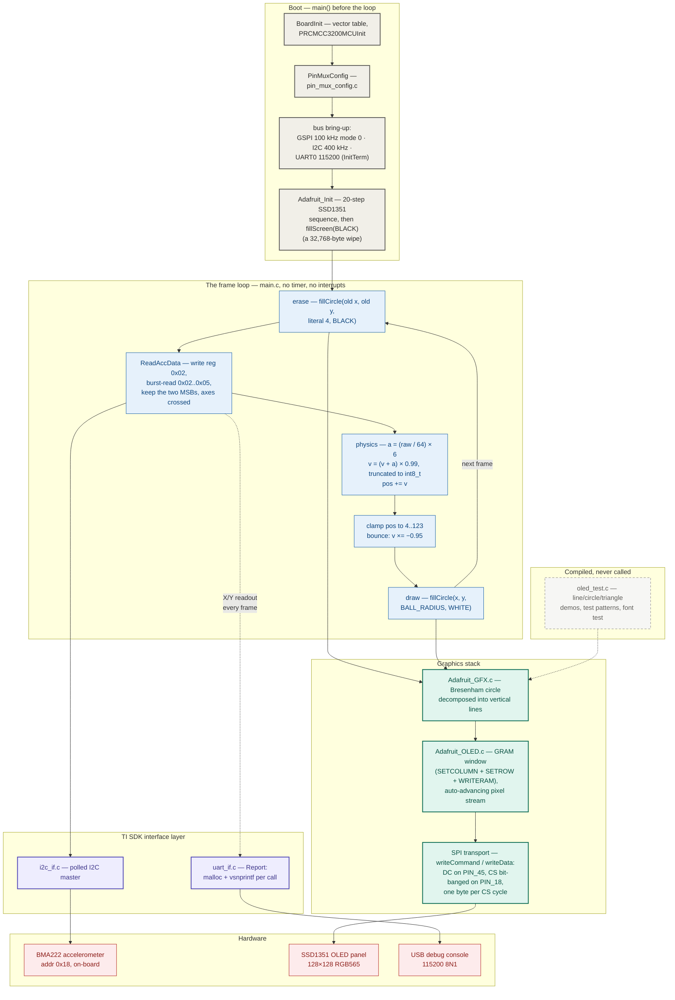
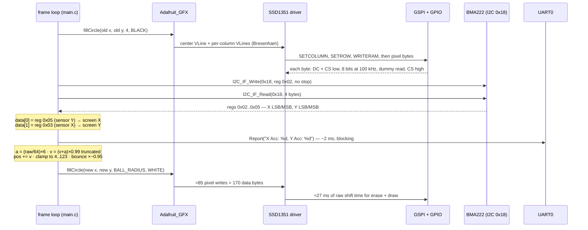

# OLED Bouncing Ball — system design

> How a tilt becomes a bounce, 340 bytes at a time.
>
> Once per loop iteration, the CC3200 asks its **on-board BMA222** for four
> acceleration bytes over 400 kHz I2C, keeps the two most-significant ones
> (axes deliberately crossed to match the screen), and folds them into an
> `int8_t` velocity whose "friction" is really **integer truncation** — a flat
> −1 px/frame decay dressed up as `× 0.99`. The ball moves by **differential
> rendering**: erase a black circle at the old position, draw a white one at
> the new position, and never touch the other 16,000 pixels — because at
> **100 kHz SPI**, repainting the whole 128×128 SSD1351 panel costs more than
> 2.6 seconds. There are no interrupts, no timers, and no framebuffer; the
> frame rate is exactly the latency of the peripherals.

This document is the developer-facing map of the whole system — every
component and how data moves between them. The companion
[README](README.md) covers the per-layer detail, wiring, building, and
flashing; the board-level schematic is
[docs/wiring-diagram.svg](docs/wiring-diagram.svg).

---

## End-to-end flowchart



**Legend** — ⬜ boot sequence · 🟦 frame loop · 🟩 graphics stack ·
🟪 TI SDK interface layer · 🟥 hardware ·
◌ dashed = compiled but unreferenced (the `oled_test.c` demo suite).

---

## How to read it: the three ideas that matter

1. **The bandwidth budget shapes everything.** `SPI_IF_BIT_RATE` is 100,000 —
   100 kHz — and a full 128×128 RGB565 frame is 32,768 data bytes, so a
   whole-screen repaint costs at least 2.6 seconds of shift time before any
   per-byte overhead. The game therefore *never* repaints: each frame touches
   only two r = 4 circles (erase in black, draw in white), about 85 pixel
   writes each, ≈340 data bytes ≈ 27 ms — a mid-30s fps ceiling instead of
   0.4 fps. Every structural choice downstream — no framebuffer, GRAM-window
   streaming, hardware-accelerated fills — exists to serve this budget. The
   one place the budget is ignored is boot: the single `fillScreen(BLACK)` is
   a deliberate multi-second wipe.

2. **The physics lives in integers, and truncation is the real friction.**
   Velocity is an `int8_t`; the update `(v + a) * 0.99` promotes to `double`
   and truncates back on assignment, and `(int)(v × 0.99)` equals `v − 1` for
   every magnitude from 1 to 99. The nominal "1% air resistance" is actually
   a linear −1 px/frame decay toward zero — which is arguably better for a
   game: the ball genuinely stops rather than creeping forever. The same
   truncation applies to the `× −0.95` bounce, so slow balls die at the wall
   in a frame or two. Acceleration is calibrated through the sensor's own
   scale: `raw / 64` converts the BMA222's ±2g, 64-LSB-per-g reading into g,
   and `× 6` turns g into pixels-per-frame².

3. **A three-vendor layer cake with one hand-written seam.** Adafruit's
   Arduino C++ graphics library — ported to plain C, class scaffolding left
   behind in comments — sits on TI's SDK (polled I2C, UART console, pin
   muxing, linker script, startup code linked in from the SDK itself). The
   seam joining them is the lab's actual assignment, marked `TODO 1/2/3` in
   [Adafruit_OLED.c](Adafruit_OLED.c): `writeCommand`/`writeData`, ~15 lines
   each, that bit-bang DC (PIN_45) and CS (PIN_18) around a single-byte SPI
   transaction. Everything the screen ever shows funnels through those two
   functions, one byte at a time.

---

## Deep dive 1 — one frame, end to end



Things worth noticing:

- **The axis crossing is the calibration.** The burst read returns X then Y,
  but the code maps sensor-Y MSB onto screen X and sensor-X MSB onto screen Y
  — that swap is how the LaunchPad's physical orientation lines up with the
  panel's `0x74` remap. The per-frame UART print exists to check exactly this:
  tilt the board and watch which number moves.
- **Erase happens before the sensor read**, so the screen is blank-ball for
  the entire I2C transaction, UART print, and physics step. At these frame
  times it reads as flicker-free because the ball is small and the gap is
  milliseconds.
- **The GRAM window does the addressing.** `fillCircle` becomes vertical
  lines; each line sets a one-column window and streams `2h` bytes; the
  SSD1351 advances its own write pointer. No per-pixel `goTo` — the only
  per-pixel cost is the two `writeData` calls.

## Deep dive 2 — anatomy of one byte on the wire

Every pixel is two of these; every command byte is one (with DC low):

```text
writeData(c)                                   Adafruit_OLED.c
  │
  ├─ GPIOPinWrite(GPIOA3, 0x80, 0x80)    DC high (PIN_45) — "this byte is data"
  ├─ GPIOPinWrite(GPIOA3, 0x10, 0x00)    CS low  (PIN_18) — panel selected
  ├─ MAP_SPICSEnable(GSPI_BASE)          hardware CS (PIN_50 — wired to nothing)
  ├─ MAP_SPIDataPut(GSPI_BASE, c)        8 bits shifted out at 100 kHz = 80 µs
  ├─ MAP_SPIDataGet(GSPI_BASE, &dummy)   blocks until the shift completes;
  │                                        drains the RX FIFO (MISO is unused)
  ├─ MAP_SPICSDisable(GSPI_BASE)
  └─ GPIOPinWrite(GPIOA3, 0x10, 0x10)    CS high — byte committed
```

- **The blocking `SPIDataGet` is the synchronization.** SPI always shifts in
  a byte while shifting one out; reading it back is what guarantees the
  transfer finished before CS rises. The value itself is garbage (the
  SSD1351 never drives MISO) and is thrown away.
- **Two chip-select mechanisms run in parallel.** The SPI module is
  configured `SPI_SW_CTRL_CS | SPI_CS_ACTIVEHIGH` and `SPICSEnable`/`Disable`
  toggle the muxed hardware CS on PIN_50 — which connects to nothing. The CS
  the panel actually sees is the PIN_18 GPIO. Correct, but a trap for anyone
  probing PIN_50 and wondering why the "CS" line flaps uselessly.
- **The ceremony is per byte, not per burst.** Even mid-`WRITERAM`, when the
  panel would happily accept a continuous stream, each byte pays the full
  GPIO + CS + blocking-read overhead. Batching bytes inside one CS window is
  the single cheapest speedup this codebase left on the table.

---

## Component inventory

| Component | Layer | Provenance | Where |
|---|---|---|---|
| Frame loop, physics, bus bring-up (`main`) | App | ✅ implemented here | [main.c](main.c) |
| `ReadAccData` — BMA222 regs 0x02–0x05, axis mapping | App | ✅ implemented here | [main.c](main.c) |
| SPI transport — `writeCommand` / `writeData` / reset-CS GPIO (`TODO 1–3`) | Driver | ✅ implemented here | [Adafruit_OLED.c](Adafruit_OLED.c) |
| SSD1351 init sequence, GRAM-window fills | Driver | Adafruit-derived scaffolding | [Adafruit_OLED.c](Adafruit_OLED.c) |
| Graphics primitives, text, 5×7 font | Graphics | Adafruit (BSD), ported to C | [Adafruit_GFX.c](Adafruit_GFX.c) / [glcdfont.h](glcdfont.h) |
| SSD1351 command set + panel dimensions | Graphics | Adafruit | [Adafruit_SSD1351.h](Adafruit_SSD1351.h) |
| Display demo suite | — | ⬜ lab scaffolding, never called | [oled_test.c](oled_test.c) |
| Polled I2C master (STD/FST) | SDK | TI SDK common | [i2c_if.c](i2c_if.c) |
| UART console (`InitTerm`, `Report`, `GetCmd`) | SDK | TI SDK common | [uart_if.c](uart_if.c) |
| Pin muxing (this project's pin choices) | Board | TI PinMux-generated | [pin_mux_config.c](pin_mux_config.c) |
| Linker script — SRAM-resident image | Build | TI SDK | [cc3200v1p32.cmd](cc3200v1p32.cmd) |
| CCS project (clone of the SDK `spi_demo` example) | Build | TI SDK example | [.project](.project) / [.cproject](.cproject) |

---

## The numbers that matter

| Value | What it is |
|---|---|
| 128 × 128 | panel resolution; RGB565, 2 bytes/pixel → 32,768 bytes per full frame |
| 100 kHz | `SPI_IF_BIT_RATE` — ≥ 2.6 s to repaint the screen, ≈ 27 ms per ball erase + draw |
| 400 kHz | I2C fast mode (`I2C_MASTER_MODE_FST`) to the accelerometer |
| 115200 8N1 | UART0 console; the per-frame readout costs ~2 ms of blocking output |
| 0x18 | BMA222 I2C address (written as decimal `24` in the code) |
| 0x02–0x05 | burst-read registers — X LSB/MSB, Y LSB/MSB; only the MSBs are used, crossed |
| 64 LSB/g | BMA222 ±2g scale implied by the `/ 64` normalization |
| 6 | pixels/frame² of ball acceleration per g of tilt (≈ ±11 at the ±2g ceiling) |
| 0.99 / −0.95 | friction / bounce factors — truncated into `int8_t`, so friction is really −1 px/frame |
| 4 / (64, 64) | `BALL_RADIUS` / starting position (screen center) |
| [4, 123] | position clamp: `BALL_RADIUS` … `SCREEN − BALL_RADIUS − 1` |
| ≈ 85 | pixel writes per r = 4 `fillCircle` (Bresenham with overdraw) |
| 0x74 / 127 | SSD1351 remap value / mux ratio from `Adafruit_Init` |
| 0x20004000 | image base: 76 KB code + 100 KB data regions, all in SRAM — no flash XIP |
| 255 × 5 | glyphs × bytes/glyph in the 5×7 font table |
| 0 | interrupts, timers, framebuffers, and heap allocations *outside* `Report()` |

---

## Verification status

There are no automated tests, and on this hardware there realistically could
not be — the system was validated the embedded way:

- **On-device observation** — flash, tilt, watch. The ball centering at
  (64, 64), responding to tilt in the right direction, and losing energy at
  walls is the acceptance test.
- **UART telemetry** — the per-frame `X Acc / Y Acc` readout at 115200 baud
  is the built-in instrument for verifying the I2C path and the axis mapping
  independently of the display.
- **The demo suite as a display self-test** — [oled_test.c](oled_test.c)
  (lines, rectangles, circles, triangles, two color-bar patterns, the full
  font table, "Hello world!") exists to validate the SPI transport and driver
  before the game runs — but note it is *not called* from `main()` in the
  committed build; wiring it in requires adding the include and the calls.
- **Build evidence** — the checked-in [Debug/](Debug/) artifacts
  (`spi_demo.bin`, `.out`, `.map`) show the project compiling and linking
  under CCS with TI ARM compiler 20.2.7.LTS against SDK 1.5.0.

---

## Design trade-offs & sharp edges

- **Differential rendering over a framebuffer** — a full RGB565 shadow buffer
  (32 KB) would actually fit in the 100 KB data SRAM, but streaming straight
  to GRAM avoids it entirely and matches the SPI budget. The costs: no
  background art (erase must paint flat black), and correctness depends on
  erase and draw agreeing — which they already don't: erase hardcodes radius
  `4` while draw uses `BALL_RADIUS`. Equal today; change the radius and the
  ball leaves rings.
- **Integer physics over floating point** — small, fast, and the truncation
  behaves like a decent game-feel decision (balls stop dead). But it means
  the tuning constants lie: 0.99 is not 1% decay, and −0.95 at low speeds is
  mostly "stop". The `int8_t` velocity would wrap past ±127, though in a
  128-pixel arena the ball hits a wall (about five frames of full tilt)
  long before that.
- **Polling over interrupts** — one loop, no ISRs, no races. The price is
  that frame pacing *is* peripheral latency: a faster SPI clock would make
  the ball move faster, not smoother, because velocity is per-frame, not
  per-second.
- **Per-byte SPI ceremony** — every byte pays two GPIO writes, a hardware-CS
  enable/disable (on a pin wired to nothing), and a blocking dummy read.
  Batching a `WRITERAM` burst inside one CS window is the obvious unclaimed
  optimization.
- **The error path returns an integer as a pointer** — `RET_IF_ERR` inside
  `int8_t* ReadAccData()` returns `-1` converted to a pointer on I2C failure,
  which `main` dereferences. Healthy wiring never trips it; broken wiring
  faults instead of failing soft.
- **Implicit declarations** — `main.c` includes no graphics header, so
  `Adafruit_Init`, `fillScreen`, and `fillCircle` are implicitly declared.
  It links and runs correctly, but the compiler is flying blind on those
  signatures.
- **Scaffolding quirks inherited downstream** — the `Adafruit_Init` comment
  claims RESET is on "GPIO28, pin 18" while the code drives RESET on PIN_08
  (GPIO17) and uses PIN_18 as CS; three init parameters (`0xF1`, `0x32`,
  `0x05`) are sent as *commands* rather than data; and the driver's clip
  math (`HEIGHT − y − 1`) drops the final row/column of clipped shapes.
- **Portability** — the CCS project hardcodes macOS SDK paths
  (`/Applications/TI/lib/cc3200sdk_1.5.0`) and links `startup_ccs.c` out of
  the SDK tree; importing on another machine means fixing
  `CC3200_SDK_ROOT` first.

---

## Provenance

An embedded-systems lab project built in three layers, judged from file
headers and content: **TI SDK scaffolding** ([i2c_if.c](i2c_if.c),
[uart_if.c](uart_if.c), [cc3200v1p32.cmd](cc3200v1p32.cmd), the CCS project
cloned from the SDK's `spi_demo` example — whose TI docs page survives as
[README.html](README.html)); **Adafruit-derived code** (BSD-licensed
[Adafruit_GFX.c](Adafruit_GFX.c), [Adafruit_SSD1351.h](Adafruit_SSD1351.h) by
Limor Fried/Ladyada, [glcdfont.h](glcdfont.h), and
[oled_test.c](oled_test.c) based on Adafruit's Arduino `test.ino`;
[oled_test.h](oled_test.h) is headed `Author: rtsang`, Jan 2024); and the
**work implemented on top**: the SPI transport marked `TODO 1/2/3` in
[Adafruit_OLED.c](Adafruit_OLED.c), the pin-mux selections in
[pin_mux_config.c](pin_mux_config.c), and the entire game —
`ReadAccData` and the physics loop — in [main.c](main.c).
